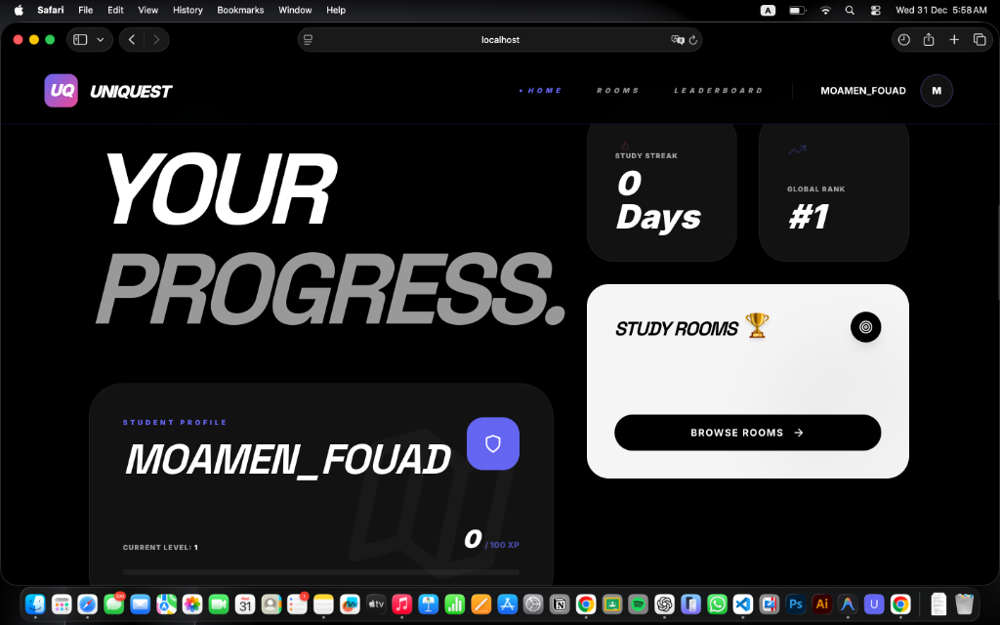
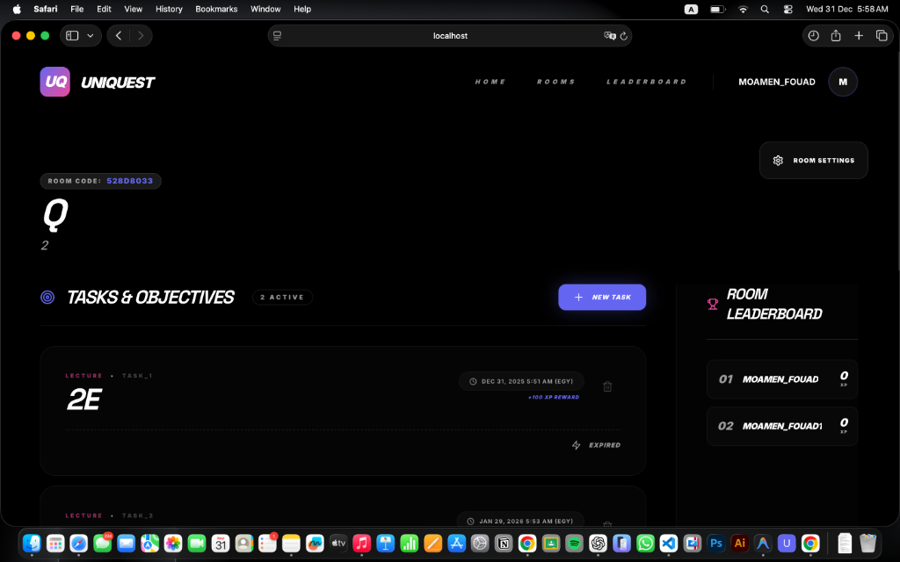
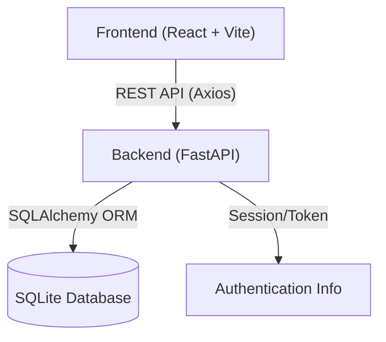

# 🎓 UniQuest: Spice Up Your University Life


> **Turn your academic journey into an epic RPG adventure.**

UniQuest is a comprehensive gamified platform designed to transform standard university activities—lectures, assignments, and study sessions—into engaging "Quests". Students earn XP, level up, compete on leaderboards, and collaborate in rooms, making productivity addictive and fun.

---

## 🚀 Features

### 🛡️ Core Gamification
- **XP System**: Earn Experience Points (XP) for every submission.
  - **Lectures**: 100 XP
  - **Assignments**: 75 XP (plus bonuses)
- **Leveling**: Progress through levels as you accumulate XP, unlocking prestige and status.
- **Streaks**: Maintain daily activity streaks to earn multipliers and badges.

### 🏢 Room System
- **Collaborative Hubs**: Join or create "Rooms" (e.g., "CS101", "Study Group A").
- **Room Codes**: Unique 8-character codes for seamless joining.
- **Privacy Controls**: Public or Private rooms.
- **Member Roles**: Admins manage tasks; Members submit work.

### ⚔️ Quests & Tasks
- **Task Types**: Lecture, Assignment, Project, Quiz, Lab.
- **Deadlines**: Real-time expiration logic. Tasks expire when the clock runs out (UTC+2 aligned).
- **Submissions**: Upload proof of work (files/images).
- **Verification**: Admins review and verify submissions to award XP.

### 🏆 Competition
- **Global Leaderboard**: Compete against every student on the platform.
- **Room Leaderboard**: Rank within your specific class or group.
- **Activity Feed**: Real-time updates of quests completed by others.

---

## 📸 Screenshots

| Dashboard | Room Details |
|-----------|--------------|
| *Overview of stats and leaderboard* | *Task management and active quests* |
|  |  |

---

## 🏗️ Technical Architecture

UniQuest is built with a modern, decoupled architecture ensuring scalability and performance.



### Tech Stack

#### Frontend
- **Framework**: React 18
- **Build Tool**: Vite
- **Styling**: TailwindCSS (Custom "Prismatic Dark" Theme)
- **Icons**: Lucide React
- **HTTP Client**: Axios

#### Backend
- **Framework**: FastAPI (Python 3.9+)
- **Database**: SQLite (Production-ready via SQLAlchemy)
- **Authentication**: Custom Session Auth + Firebase Integration support
- **Server**: Uvicorn

---

## 🛠️ Installation & Setup

### Prerequisites
- Python 3.9+
- Node.js 16+
- Git

### 1. Clone Repository
```bash
git clone https://github.com/yourusername/uniquest.git
cd uniquest
```

### 2. Backend Setup
```bash
cd backend
python3 -m venv venv
# Activate Virtual Environment
source venv/bin/activate  # macOS/Linux
# venv\Scripts\activate   # Windows

pip install -r requirements.txt
./run.sh
```
*The backend runs on `http://localhost:8000`.*

### 3. Frontend Setup
```bash
cd frontend
npm install
./run.sh
```
*The frontend runs on `http://localhost:5173`.*

---

## 📦 Deployment

### Backend (Railway/Render)
1. **Build Command**: `pip install -r requirements.txt`
2. **Start Command**: `uvicorn app.main:app --host 0.0.0.0 --port $PORT`
3. **Environment**: minimal setup required.

### Frontend (Vercel/Railway)
1. **Build Command**: `npm run build`
2. **Output Directory**: `dist`
3. **Environment Variable**: Set `VITE_API_URL` to your production backend URL.

---

## 🤝 Contributing

1. Fork the Project
2. Create your Feature Branch (`git checkout -b feature/AmazingFeature`)
3. Commit your Changes (`git commit -m 'Add some AmazingFeature'`)
4. Push to the Branch (`git push origin feature/AmazingFeature`)
5. Open a Pull Request

